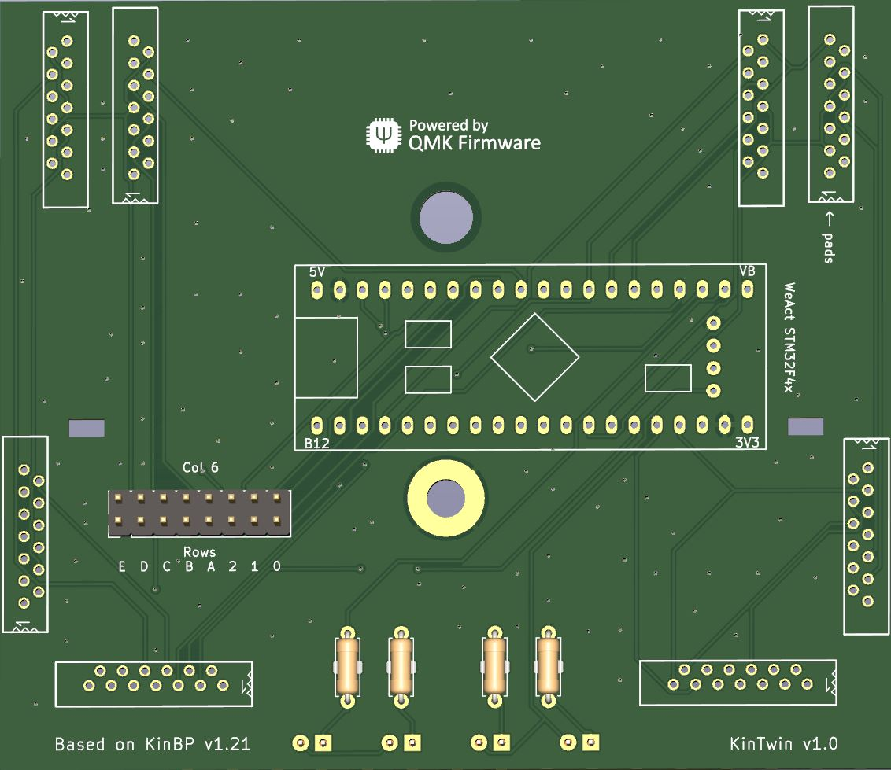
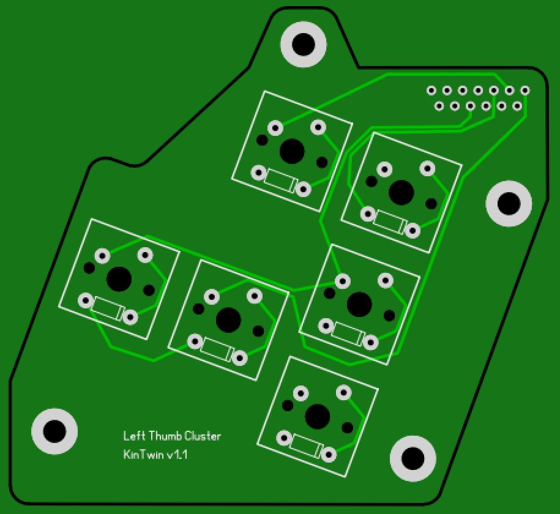
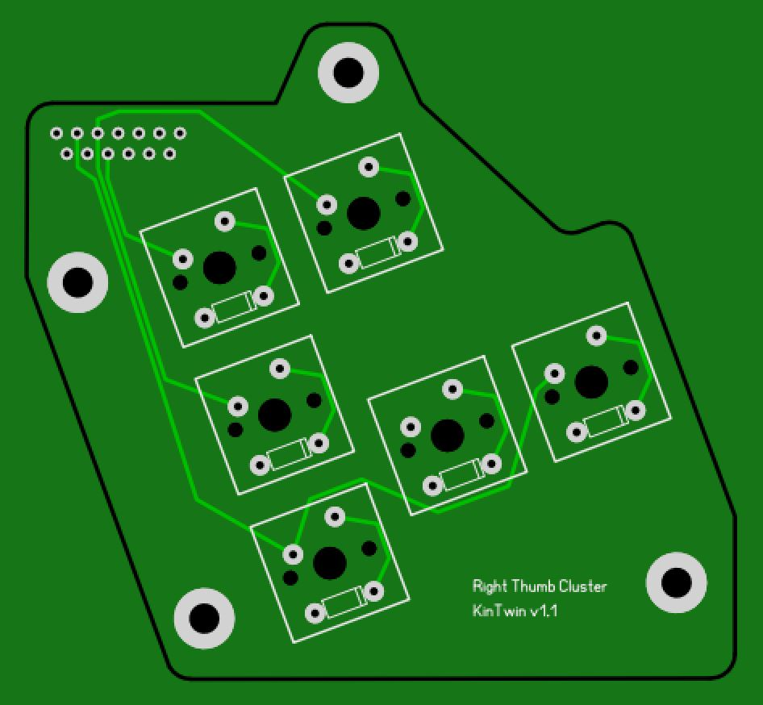
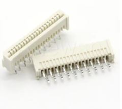
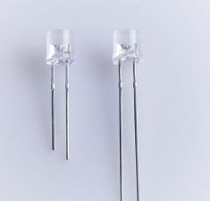
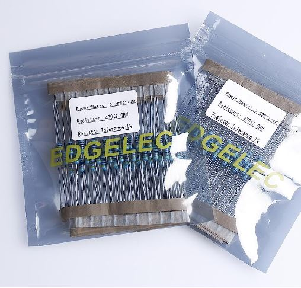
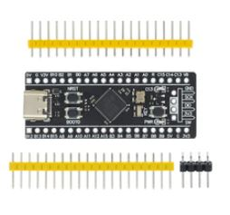
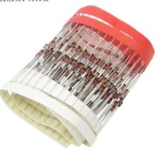
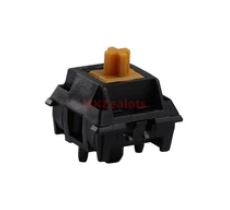

# KinTwin
KinTwin is a fork of [KinBP](https://github.com/DmNosachev/KinBP). It is a drop-in replacement of a controller and thumb cluster PCB boards for [Kinesis Contoured keyboards](https://deskthority.net/wiki/Kinesis_Contoured).

It serves the same purpose as [KinT controller](https://github.com/kinx-project/kint) created by Michael Stapelberg.

## PCBs

## Comparison with KinT and KinBP
- The controller board is a simplified version on KinBP board. It uses **WeAct Studio STM32F401** development board. KinT controller uses Teensy board. The price difference makes it very hard to justify the usage of Teensy development board these days
- KinTwin controller board uses only FPC connectors to interface with other PCB boards. In that regard it has the same design as stock Kinesis Advantage II
- KinTwin controller does not support soldered connectors between the controller board and thumb cluster boards
- Similar to KinBP repo, KinTwin includes PCB boards for thumb clusters. They are functionally identical to stock Kinesis Advantage II. Unlike KinBP, these PCBs are not reversible (hence there are 2 of them). Also, similar to stock boards, they use through-hole diodes and FPC connectors
- Controller board was originally designed in KiCad by [DmNosachev](https://github.com/DmNosachev). KinTwin is a cloned and simplified version of the original design and as such it also uses KiCad
- Thumb cluster boards were designed in [Sprint Layout 6.0](https://www.electronic-software-shop.com/lng/en/electronic-software/sprint-layout-60.html?language=en)

## Controller compatibility with top row PCBs, keywell PCBs and thumb cluster PCBs

|Keyboard Model                             |Top row PCBs|Keywell PCBs|Thumb cluster PCBs|
|-------------------------------------------|------------|------------|------------------|
|KB600 (Advantage2)                         |Yes         |Yes         |Yes               |
|KB500 (Advantage)                          |Yes         |Yes         |No  *             |
|KB13x (Essential, Classic, Professional)   |Yes         |Yes         |No  *             |
|100/110/120 **                             |No          |No          |No  *             |

\* These keyboards require custom thumb cluster PCBs which are provided in the repo\
** You are likely not going to find these keyboards in the wild. They are 20+ years old

## BOM (for models KB600)

|Name                                                                |Quantity  |Image  |
|--------------------------------------------------------------------|----------|-------------------------------------------------|
|13-pin straight FPC connectors                                      |    6     |       |
|3mm Blue LED Diodes (DC 3.0V-3.2V (IF=20mA) / 0.06 Watts / 2pin)    |    4     |             |
|430ohm (For DC 6-12V) 1/4 Watt Metal Film Resistors                 |    4     |        |
|STM32F401 development board                                         |    1     ||
|Diodes (1N4148 DO-35 IN4148)                                        |    68    |           |
|Keyboard switches                                                   |    68    |         |
|Controller board                                                    |    1     |      |

## BOM (for models KB500) 
The same as for model KB600, except for:

|Name                                     |Quantity |
|-----------------------------------------|---------|
|13-pin straight FPC connectors           |    8    | 
|Thumb cluster board                      |    2    |
|FPC flexible flat cables (FFC1.25-60mm)  |    2    | 

## BOM (for models KB13x)
The same as for model KB600, except for:

|Name                                    |Quantity  |
|----------------------------------------|----------|
|13-pin straight FPC connectors          |    6     | 
|13-pin angled FPC connectors            |    2     |
|Thumb cluster board                     |    2     |
|FPC flexible flat cables (FFC1.25-60mm) |    2     | 