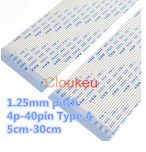
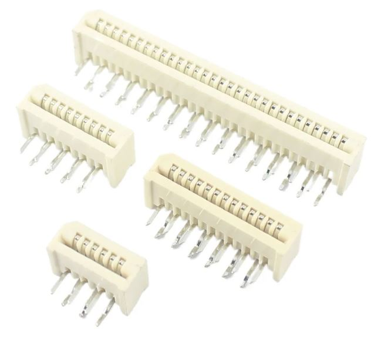

# KinTwin
KinTwin is a fork of [KinBP](https://github.com/DmNosachev/KinBP). It is a drop-in replacement of a controller and thumb cluster PCB boards for [Kinesis Contoured keyboards](https://deskthority.net/wiki/Kinesis_Contoured).

## Goals
- Replace stock firmware with [QMK](https://docs.qmk.fm/#/) open source firmware
- Show clear and concise BOM (bill of materials) required for the upgrade depending on Kinesis keyboard model

## Included PCBs

||
|-|
|        
| 

> **Warning**  
> I have recently updated the design of thumb cluster PCB from v1.0 to v1.1 
> The changes are cosmetic and should not affect functionality, but I did not order the new boards to be able to confirm that they still work.  
> Changes include: 
> - moved silk screen of the FPC connector pad to the correct side
> - changed mounting holes of the FPC connector pad to be plated

## Comparison with KinBP
- The controller board is a simplified version on KinBP board. It uses **WeAct Studio STM32F401** development board
- KinTwin controller board uses only FPC connectors to interface with other PCB boards. In that regard it has the same design as stock Kinesis Advantage II
- KinTwin controller does not support 10-pin 2.54mm headers which are used to connect the controller to thumb cluster boards
- Similar to KinBP repo, KinTwin includes PCB boards for thumb clusters. They are functionally identical to stock Kinesis Advantage II. Unlike KinBP, these PCBs are not reversible (hence there are 2 of them). Also, similar to stock boards, they use through-hole diodes and FPC connectors
- The controller board was originally designed in KiCad by [DmNosachev](https://github.com/DmNosachev). KinTwin controller board is a clone of KinBP which was slightly modified by removing extra connector pads. 
- Thumb cluster boards were designed in [Sprint Layout 6.0](https://www.electronic-software-shop.com/lng/en/electronic-software/sprint-layout-60.html?language=en)

## Controller compatibility with top row PCBs, keywell PCBs and thumb cluster PCBs

|Keyboard Model                             |Top row PCBs|Keywell PCBs|Thumb cluster PCBs|
|-------------------------------------------|------------|------------|------------------|
|KB600 (Advantage II)                       |Yes         |Yes         |Yes               |
|KB500 (Advantage)                          |Yes         |Yes         |No  *             |
|KB13x (Essential, Classic, Professional)   |Yes         |Yes         |No  *             |
|100/110/120 **                             |No          |No          |No  *             |

\* These keyboards require custom thumb cluster PCBs which are provided in the repo\
** You are likely not going to find these keyboards in the wild. They are 20+ years old

## BOM (common for all models)
|Name                                                                |Quantity  |Image  |
|--------------------------------------------------------------------|----------|-------------------------------------------------|
|3mm Blue LED Diodes (DC 3.0V-3.2V (IF=20mA) / 0.06 Watts / 2pin)    |    4     |             |
|430ohm (For DC 6-12V) 1/4 Watt Metal Film Resistors                 |    4     |        |
|STM32F401 development board                                         |    1     ||
|Controller board                                                    |    1     |      |

## BOM (for model KB600)
|Name                                                                |Quantity  |Image  |
|--------------------------------------------------------------------|----------|-------------------------------------------------|
|13-pin straight FPC connectors                                      |    6     |       |

## BOM (for model KB500) 

|Name                                     |Quantity |Image                                               |
|-----------------------------------------|---------|----------------------------------------------------|   
|13-pin straight FPC connectors           |    8    |      |
|Left thumb cluster board                 |    1    |      |
|Right thumb cluster board                |    1    |     |
|FPC flexible flat cables (FFC1.25-60mm)  |    2    |          |
|Diodes (1N4148 DO-35 IN4148) for thumb cluster PCBs|    12   ||
|Keyboard switches for thumb cluster PCBs |    12   |        |

## BOM (for models KB13x)

|Name                                     |Quantity |Image                                                |
|-----------------------------------------|---------|-----------------------------------------------------|   
|13-pin straight FPC connectors           |    6    |       |
|13-pin angled FPC connectors             |    2    ||  
|Left thumb cluster board                 |    1    |       |
|Right thumb cluster board                |    1    |      |
|FPC flexible flat cables (FFC1.25-60mm)  |    2    |           |
|Diodes (1N4148 DO-35 IN4148) for thumb cluster PCBs|    12   | |
|Keyboard switches for thumb cluster PCBs |    12   |         |