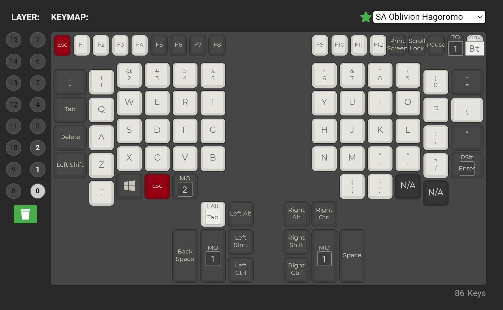
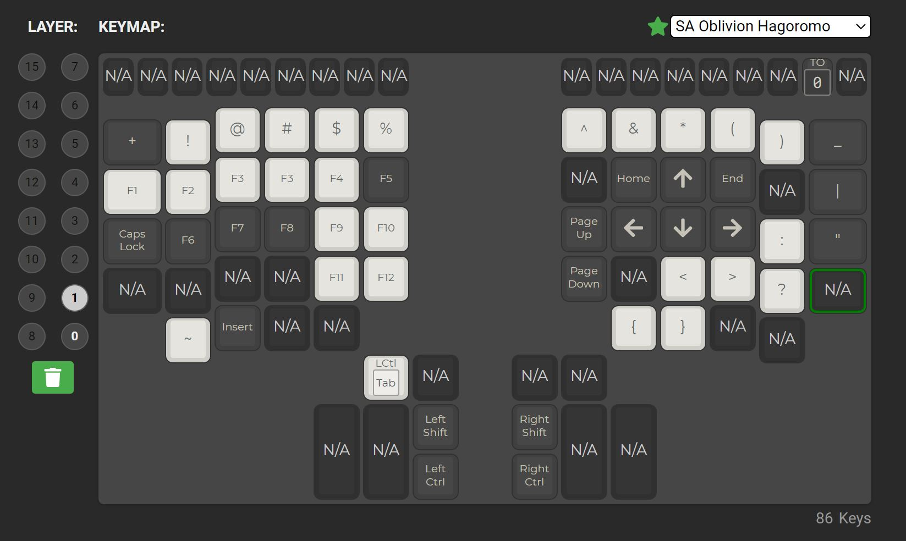
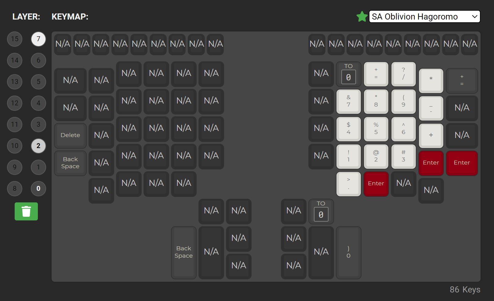

## Custom Layout
Contoured Kinesis keyboards can be setup for a layout that is impossible to recreate on a keyboard lacking thumb clusters. The custom layout below attempts to take full advantage of thumb cluster keys by simultaneously pressing multiple modifiers with only two fingers.

### Software Developer Layout
The **soft_dev** layout is optimized for a software development on a Windows machine. It is a result of trial and error of TMK/QMK features and many years of daily usage. 
Even if it might not be exactly what you are looking for, I am sure that some of the ideas could be useful when designing a new layout.

#### Layout Considerations
- **fast operations** - Contoured Kinesis keyboards have enough keys to avoid using such QMK features as "Leader Key" or "OneShot key"
- **specific finger tasks** - some fingers are much better at certain tasks than others on Kinesis keyboards. For example, using little finger by repeatedly pressing a key is a much faster operation than using a thumb key. At the same time a thumb finger is perfect for pressing one or more modifier keys at the same time
- **rarely used keys** - some keys are rarely used. Some key presses are hard to execute. It is a good idea to map rarely used keys to hard to press positions. For example, the hardest keys to press are by a little finger on lowest row, at least for me. TILDE\BACKTICK key is a good candidate for this

#### Layout Features
- 3 layers: default layer, keypad layer, numpad layer
- keypad layer allows for 2 finger operation (using the same hand) using **arrow** keys together with
    - **CTRL** and/or **SHIFT** modifiers OR
    - **HOME/END** keys OR
    - **PAGEUP/PAGEDOWN** keys.  
- two finger operations can be achieved by holding up to 3 modifier keys (KEYPAD/SHIFT/CTRL) with a thumb finger and using index/middle/ring finger by pressing keywell keys. For example, you can fully control caret position and text selection of:  
    - each letter
    - each word
    - from the current caret position to the begining of the line
    - from the current caret position to the end of the line
    - multiple lines
    - multiple pages
- combining key combinations together can also be very beneficial. For example, executing "KEYPAD + O" and then "KEYPAD + SHIFT + U" selects the whole line of text in any text editor
- keypad layer also allows for the access of the following keys by moving a single finger from the home row 
    - function keys (F1-F12)
    - **ESC** key
    - **CAPSLOCK** key
- **KEYPAD** key is a "momentary" modifier key which is used to switch to the keypad layer while the key is being pressed. There are 2 KEYPAD keys which are ENTER/DELETE keys on Kinesis thumb cluster keyboards
- **KEYPAD** key can also be used to access US ANSI Shifted Symbols instead of pressing a SHIFT key
- **NUMPAD** "momentary" modifier key can be used to quickly switch to a numpad while typing alphanumeric strings

#### Layout Layers

 
 
 

#### Notes
- MO(1) - switch to keypad layer while key is being pressed
- MO(2) - switch to numpad layer while key is being pressed
- TO(0) - switch to base layer 
- Rsft(Enter) - acts as an Enter key when pressed and released. Acts as a shift modifier in combination with outher keys
- Bt - enter in DFU mode so a firmware can be flashed to the controller
- Alt(Tab) - Alt + Tab
- Ctrl(Tab) - Ctrl + Tab